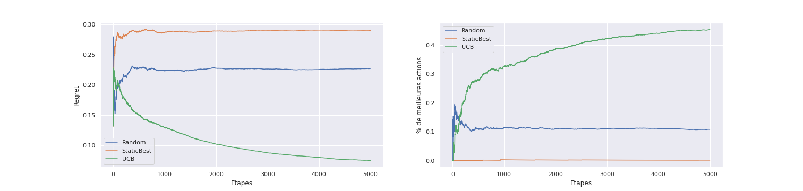
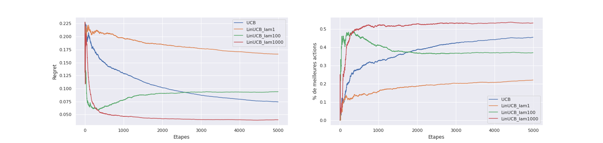
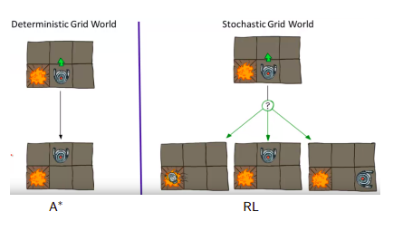
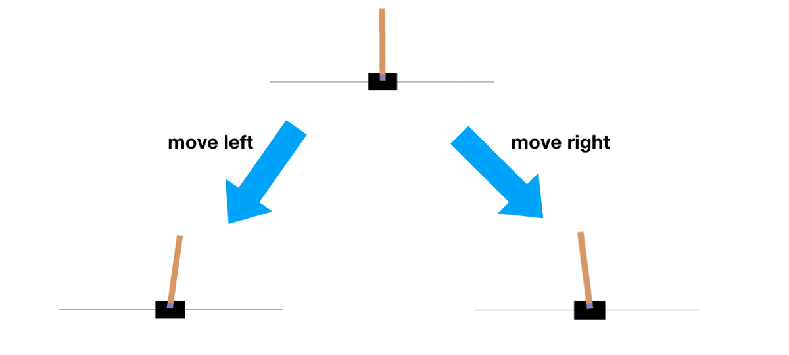
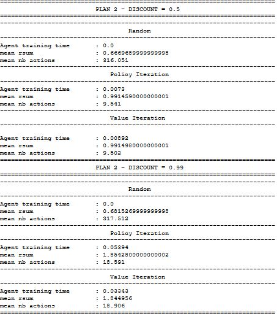
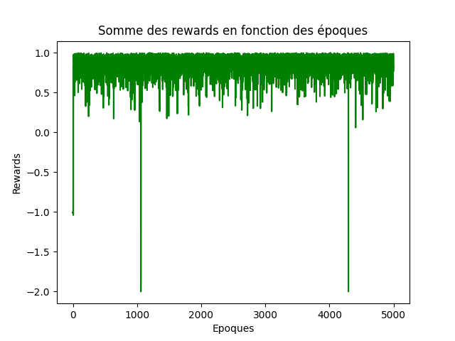
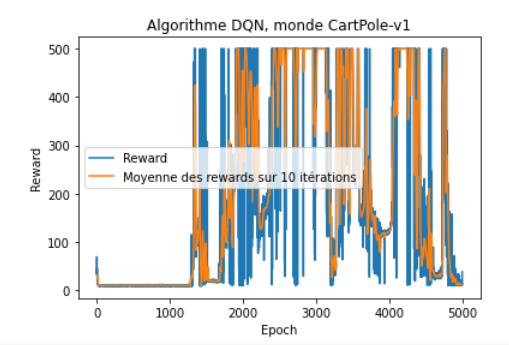
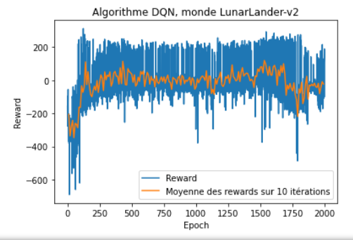
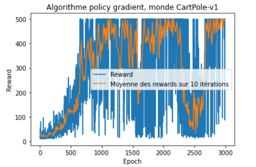
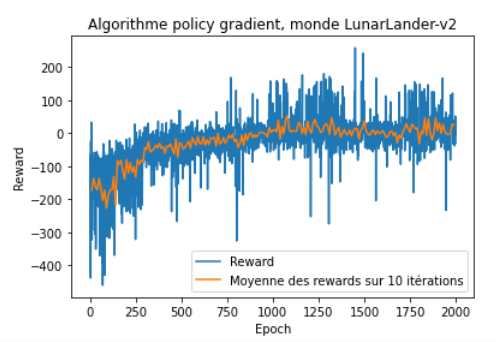

# Reinforcement-learning

Ce repository contient le code d'implémentation et de test de quelques algorithmes d'apprentissage par renforcement.

## Algorithmes de Bandits (bandits stochastiques, bandits contextuels) :

### Problématique :

 * Nous appliquons les algorithmes **UCB** et **LinUCB** au problème de la sélection de publicité en ligne.
 * On a dix publicités au total et 5000 articles. 
 * On dispose également d’une répresentation vectorielle de chaque articles. 

### Objectif :

* Le but est d’afficher pour chaque article une des dix publicités de sorte à **maximiser le taux de clic**.

### Implemntation et évaluation des stratégies :

Nous avons testé les stratégies suivantes :

* ***Stratégie random*** : A chaque itération on choisit n’importe quel annonceur
* ***StaticBest*** : A chaque itération on choisit l’annonceur avec le meilleur taux de clics cumulé
* ***Stratégie Optimale*** : A chaque iteration on choisit l’annonceur qui a le meilleur taux de clics à cette itération
* ***UCB***
* ***LinUCB*** : Pour chaque publicité, suppose que le taux de clic à une dépendance linéaireavec la répresentation de l’article et utilise une régression ridge pour l’entraînementet une sélection semblable à UCB. 

**Dans nos expériences, nous avons fait varier le paramètre λ de régularisation de la régression ridge**.

  

Comme on pouvait s’y attendre:

* la stratégie Random sélectionne la meilleur pub qu’une fois sur 10.
* La stratigie StaticBest à de très mauvaise performances car au départ toutes les pub ont untaux de clics cumulé nulle. et comme le taux de clics est toujours positif, la stratégie révientà choisir une pub aléatoirement puis à toujours l’afficher.
*  Quant à la stratégie UCB, elle obtient de meilleurs performances.

  

* L’approche LinUCB s’inspire de UCB avec une prise en compte du contexte (ici les articles).La figure ci-dessu montre les résulats obtenus par UCB et LinUCB avec différentes valeurs du coefficient de régularisation λ. 
* On observe que λ influence beaucoup les performances. parmis les valeurs testées (1, 100, 1000), seul la valeur λ= 1000 permet d’avoir des performances supérieurs à UCB.

#### Note : Dans la suite les diffirents modèles et stratégies seront évalués sur les environements **Cartpole**, **Lunar** et **GrildWorld**(le plus souvent) et on s'intéresse au reward cumulé.

  

  

  

## Programation dynamique (Value Iteration et Policy Iteration):

**Policy iteration** et **Value iteration** sont des méthodes qui utilise repectivement les équa-tions de Bellman et de Bellman optimal pour faire converger une politique vers la politiqueoptimale lors qu’on dispose d’un MDP connu (ou estimé).

La figure suivante montre quelques résulats obtenus sur l’un des environnements GridWorld. 

  

* On obseve que Policy iteration et value iteration permettent d’obtenir des rewards meilleurs à la politque aléatoire. Les agents obtenus par les deux méthodes donne sensiblement les même rewards. On observe également que plus la valeur du discount est petite plus le nombred’étapes que les agents mettent à terminer un episode l’est aussi.

## TD learning : Q-learning, Dyna-Q.

  

## Deep-Qlearning DQN:

Le Q-learning se heurte à certaines limites lorsque le nombre d’états et d’actions est élevéparmis lequelles :

* La mémoire necessaire pour stoker Q
* La capacité de génralisation.

DQN s’attaque à ces problèmes en utilisant un réseaux de neurones pour approximer les Q-value.La figure suivante  montre les résultats obtenus sur CartPole

  

  

## Policy Gradient : Actor Critic

La méthode Policy gradient optimise directement la stratégie (policy)

* Un reseaux de neuronnes pour estimer la policy pi (Actor)
* Un réseaux de neuronnes pour estimer la fonction valeur, et calculer donc l'avantage de suivre pi (Critic).

  

  

* Curriculum learning, reward shaping (apprentissage incrémental: de sous tâches plus simples vers la tâche finale)

Note : le code des modèles est ajouté au fur et à mesure

